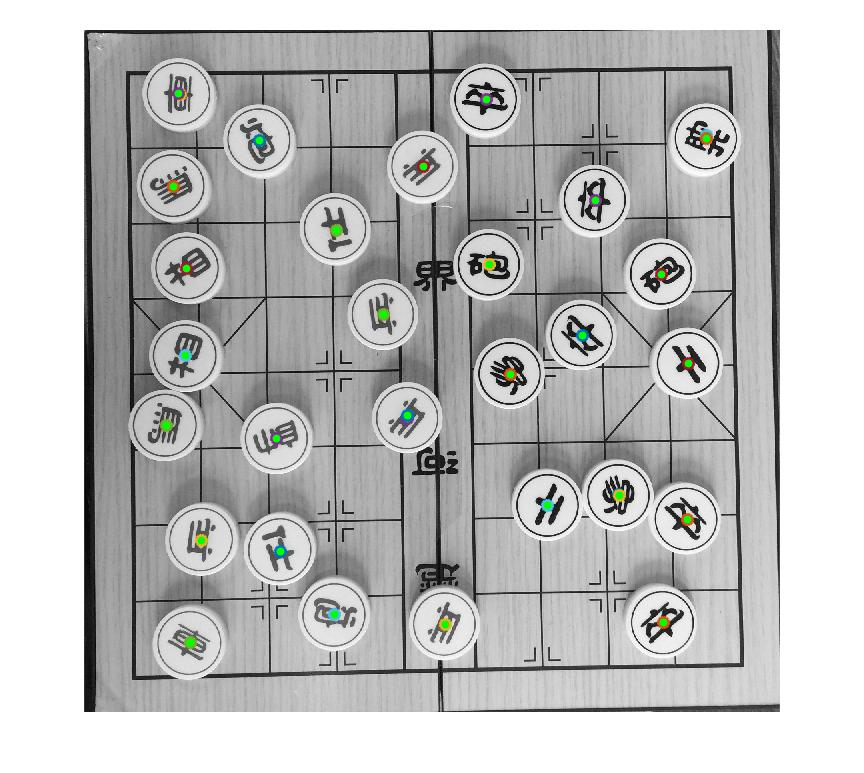

Chinese-chess-with-uARM
=========================

This is a project I am doing in my company.
It uses SIFT to distinguish chess, and I would use CNN to repeat.

Video:

1.https://youtu.be/T8ykd8ZYw6M

2.https://youtu.be/Tq3fCE87YtA

When running this code,you should install 2 Spport Package first.
    
#####   1.vlfeat-0.9.20 
* you can download and install this package step by step following the instructions http://www.vlfeat.org/install-matlab.html
        
        
#####  2.OS Genertic Video Interface
* This is a MATLAB SUPPORT PACKAGE.It can using support package installer on matlab software’s home->Get Hardware Support Packages.and you can install USB Webcams if necessary.

#### Reference：
* 1.https://web.stanford.edu/class/ee368/Project_Autumn_1516/Reports/Yu.pdf

Auto-place
----------

Auto-place is an add function.It can find the centers of Scattered chesses and then recognize it

Video:
https://youtu.be/XUtphr3TTZ4

